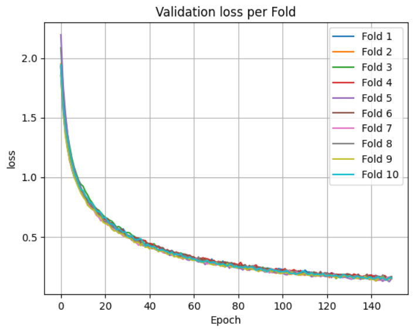
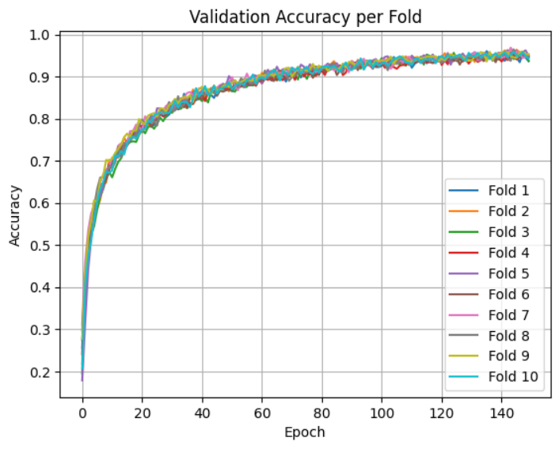
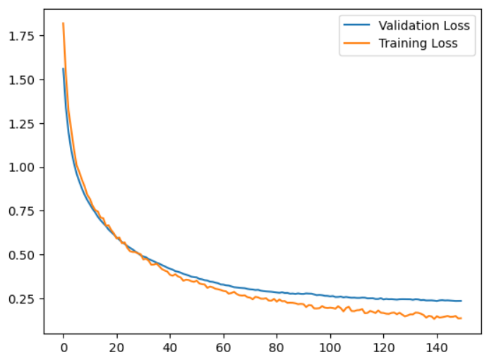
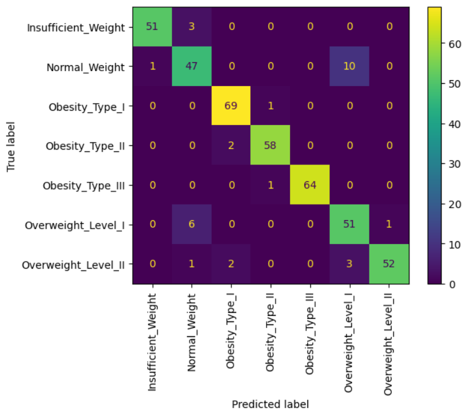
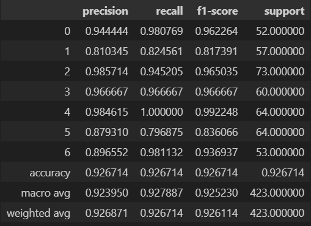
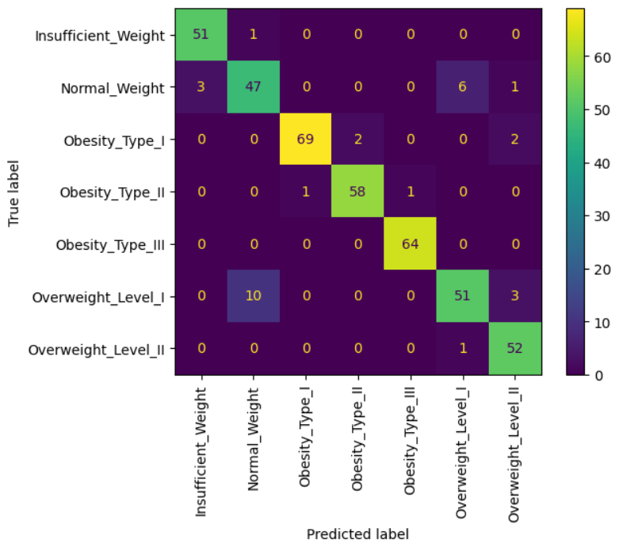
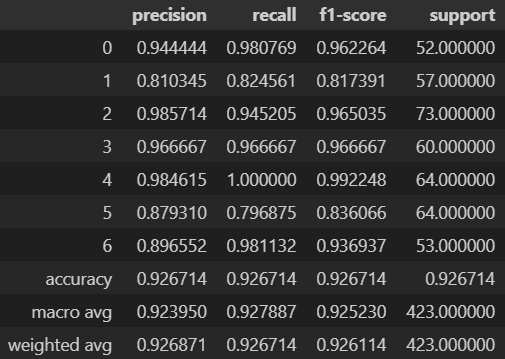

# Obesity Level Classifier using Neural Networks

## Description
According to WHO, from the year 2022 alone, more than 2 Billion adults aged 18 years and older were overweight, with 30% of them now classified under obese.
31% of the respondents from this data came from South East Asia, and is only projected to increase in later years.
And while some tools such as BMI are readily available, some of them do not take into account the lifestyle of the individual, and may face inaccuracies about their health.
The aim of this model is to predict the level of obesity of a particular individual, given the usual metric like height and weight, as well as the lifestyl that the individual leads.

### Contents

### Quick Figures:

Cross Validation Loss

Cross Validation Accuracy

Train vs Validation Loss

Confusion Matrix under Validation Data

Classification Report under Validation Data

Confusion Matrix under Test Data

Classification Report under Test Data

## Contents

The repository contains the following:
- **Data**:

  Contains the original .csv dataset (titled "ObesityDataSet_raw_and_data_sinthetic.csv") as well as its split versions, train and test, with train containing 80% of the data,
  while the test contains the remaining 20%.
  These Datasets are preprocessed by the Data_Preprocessing notebook located in the /Notebooks directory.
- **Model**:

  Contains the models saved through tensorflow's .keras extension; there's minimal difference between each model, but for the purposes of demonstration,
  the obesity_predictor.keras was selected.
- **Notebooks**

  Contains the notebooks used to preprocess the data, construct the neural network, and evaluation.
  - Data_Preprocessing contains the preprocessing procedure on the dataset.
  - Model_Training contains the neural network construction and its training, as well as some visualization on the model's performance during training.
  - Model_Evaluation contains the neural network's performance on unseen data.
- **imgs**

  used for storing the images shown here.
- **tools**

  contains the following files:
  - class_weights: the model has varying levels of skill in detecting specific classes, and so I added class_weights in order to give weights to lower-scored classes.
  - labels: contains the Original Labels after being converted by LabelEncoder. Use .inverse_transform after loading the labels.sav file to acquire the classes.
  - scaler: Uses StandardScaler fro sci-kit learn.
  - targ_enc: I used target encoding for some of the categorical data; after target encoding, I used standard scaler.
  
## Data Source
The dataset was originally sourced from Kaggle: 
https://www.kaggle.com/datasets/fatemehmehrparvar/obesity-levels

